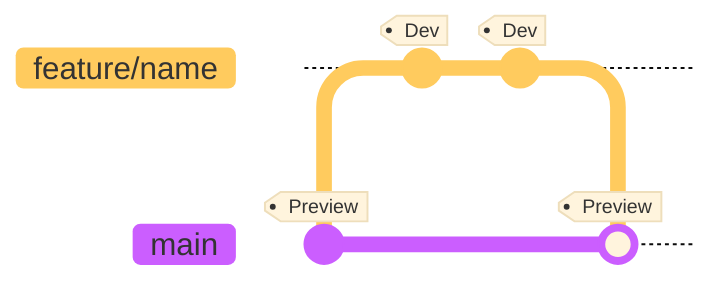
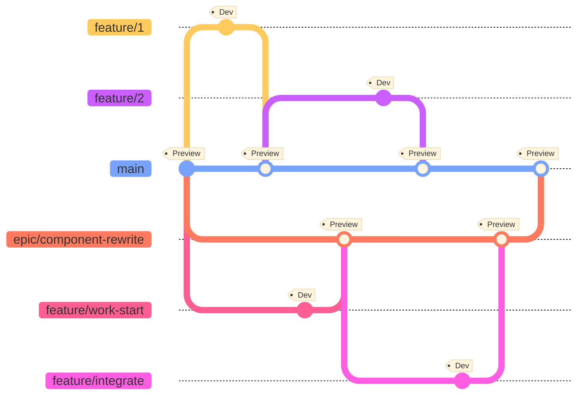
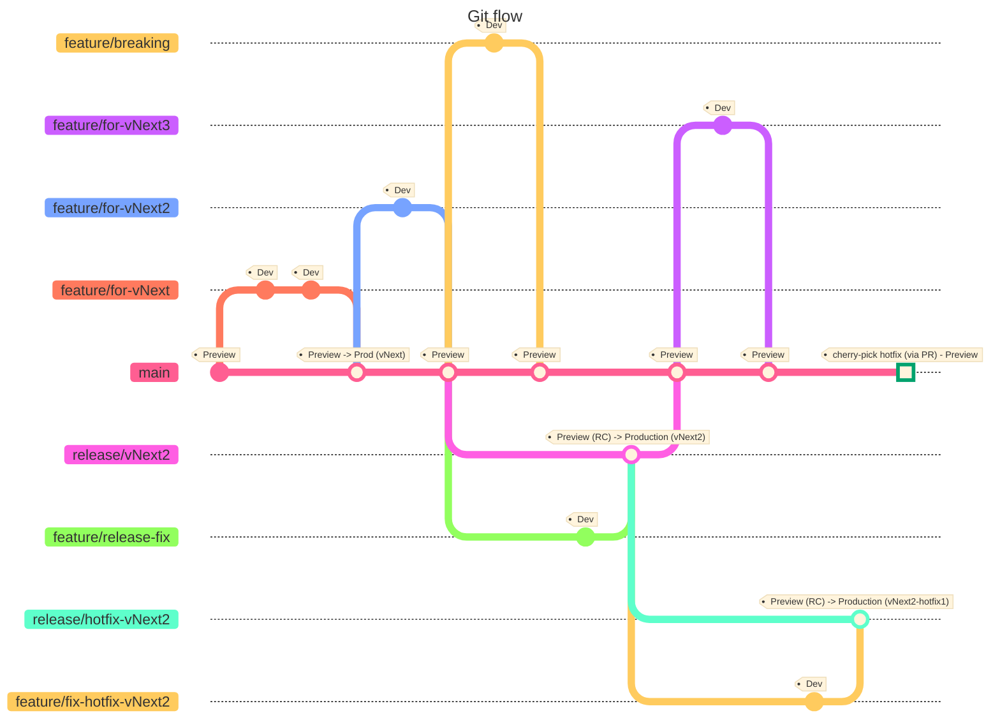

# Git flow in detail

The [parent page](./gitflow.md) offers an overview of the proposed _Git flow_.
This document describes in detail each use case during development and
releasing.

## Developing

### New features and fixes

Developers implements new features and bug fixes from a new branch each time.
The feature branches have the prefix `feature/` and start from the `main` (or
`develop`) branch.

The recommended merging strategy is _squashing_ to maintain a clean history in
the main branch.

### Large breaking feature

Large features may take several work batches to implement, breaking or making
the product unstable for a period of time. For these cases, consider having a
parallel branch to _main_ to merge related features. It allows to break a large
work into smaller features, while not impacting other developers or the main
product development.

It also allows to configure different temporal branch policies, for instance
disable quality gates or even building some components, while the new work is
being implemented.

Depending on the work, consider configuring the _epic_ branch to build and
deploy on a separate environment for validation.

> [!TIP]  
> Prioritize merging the _epic_ branch as soon as possible. The maintaince cost
> increases quickly and it can be tricky to merge back later.

## Releasing

### Simple from main

TODO

### From release branch

TODO

### Release stabilization fixes

TODO

### Patch release

TODO

## Complete diagram

