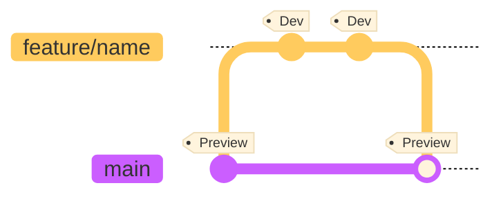
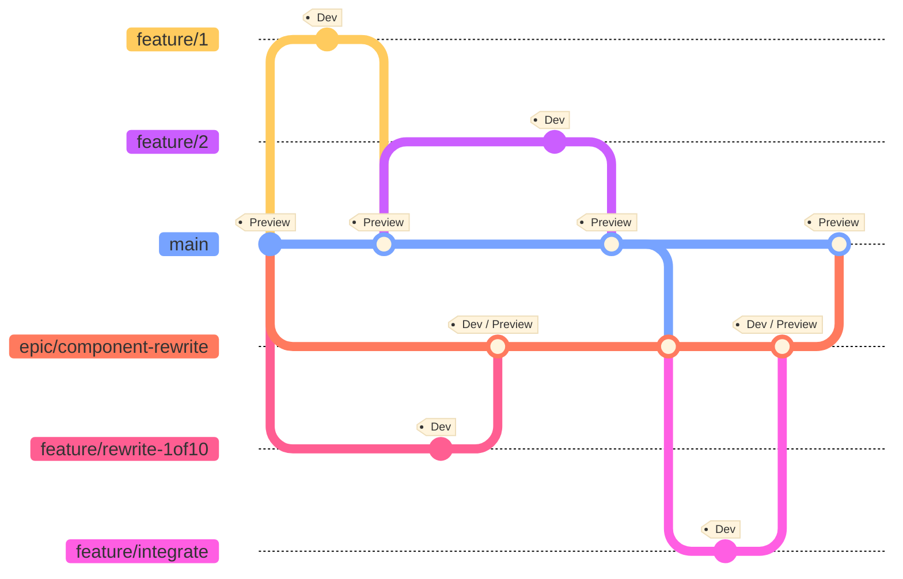
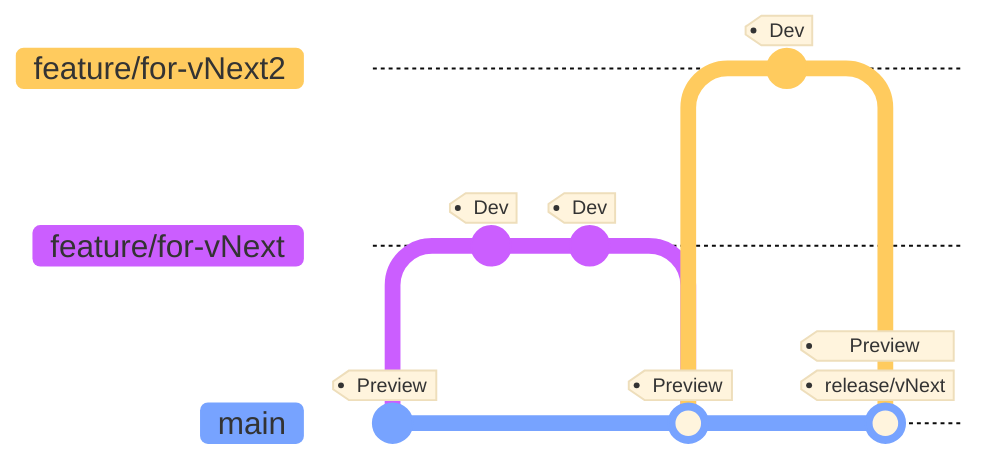
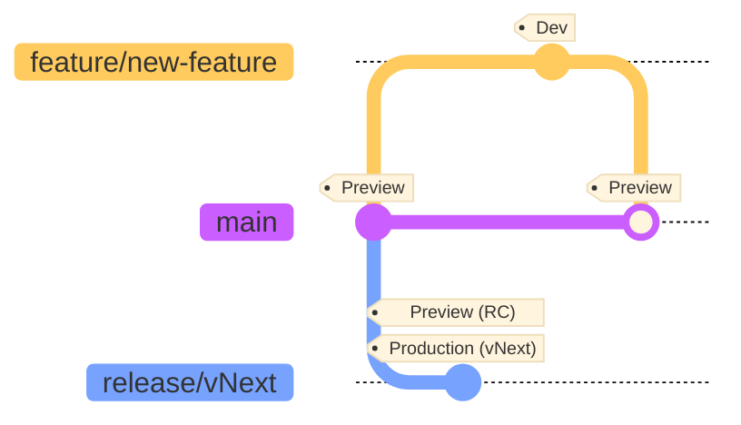
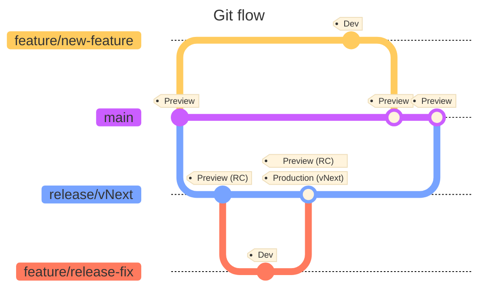
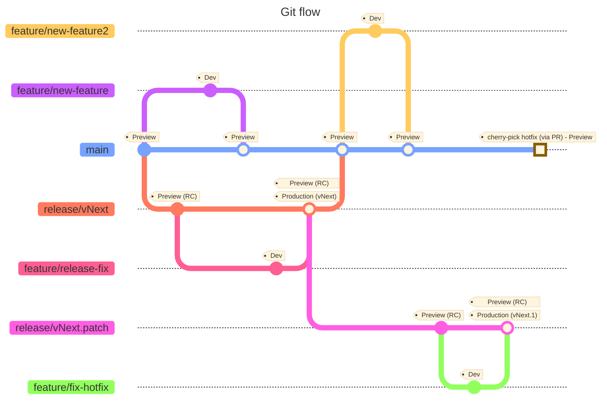
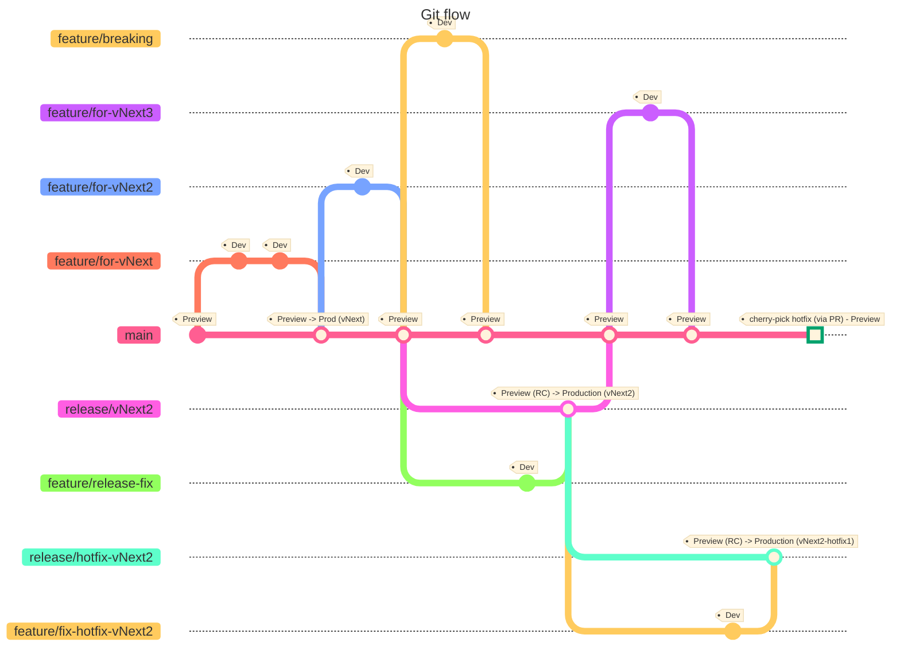

# Git flow in detail

The [parent page](./gitflow.md) offers an overview of the proposed _Git flow_.
This document describes in detail each use case during development and
releasing.

## Developing

### New features and fixes

Developers implement new features and bug fixes from a new branch each time. The
feature branches have the prefix `feature/` and start from the `main` (or
`develop`) branch.

The recommended merging strategy is _squashing_ to maintain a clean history in
the main branch.

### Epic features

Large features may take several work batches to implement, breaking or making
the product unstable for a period of time. For these cases, consider having a
parallel branch to _main_ to merge related features. It allows breaking a large
work into smaller features, while not impacting other developers or the main
product development.

It also allows configuring different temporal branch policies, for instance
disable quality gates or even building some components, while the new work is
being implemented.

Depending on the work, consider configuring the _epic_ branch to build and
deploy on a separate environment for validation.

> [!TIP]  
> Prioritize merging the _epic_ branch as soon as possible. The maintenance cost
> increases quickly, and it can be tricky to merge back later. Consider doing
> periodic merges from main to the epic branch.

## Releasing

### Simple from main

The simplest way to release is from the _main_ branch. Create a git tag to
trigger a pipeline or start it manually. It should promote the latest build
deployed in the preview environment (after running proper validations) on the
_same commit_ to the production environment.

As part of the release process, the commit deployed must always have a git tag
with the version number.

> [!TIP]  
> This process works well in small projects. It will block any further
> development until the release is done. Consider the
> [release branch workflow](#from-release-branch) to avoid blocking the
> development team.

<!-- Just to have two tips -->

> [!WARNING]  
> The downside of this process is that it usually doesn't allow using a separate
> versioning strategy for _preview_ and _production_ builds without rebuilding
> the same commit in the publishing to production process. The binaries that end
> in production may not be the same tested.

### From release branch

A release branch offers a dedicated process for releasing while not blocking
further product development.

Create a new release from the _main_ branch including the prefix `release/` and
the target version. Some utilities like [GitVersion](https://gitversion.net/)
can even pick the version number from the branch name and automatically assign
it in the product.

Builds from the branch are considered _release candidates_ (RC). They should
have a valid production version number. These binaries should pass a set of
quality assurance tests in an environment close to production.

Once the product is ready, create a git tag or start manually a pipeline to
release to production. This pipeline will _promote_ the artifacts into
production. The commit should end with a git tag with the version number.

After the release, it's safe to remove the release branch. It's always possible
to recreate it from the git tag.

> [!TIP]  
> Promoting to production means taking the exact same binaries used for the
> quality assurance tests and publishing them. It's important to not trigger
> again a build process, so the binaries that end in production are exactly the
> same that passed the tests.

### Release stabilization fixes

As part of the quality assurance process of a _release candidate_ build in the
release branch, new issues found may require fixes. These fixes should be
prioritized for the ongoing release.

The recommendation is to create a [feature](#new-features-and-fixes) branch from
the current release branch. Then merge it back to the release branch, triggering
a new _release candidate_ build.

To get the fix into main there are two strategies:

- After the release, merge the release branch back into the main branch. Use a
  standard merge strategy instead of _git squash_ to preserve the commits of the
  different fixes.
- Create a new feature branch from _main_ and cherry-pick the merge commit of
  the fix (or the commits of the feature fix branch before merging).

### Patch release

A _patch_ or _hotfix_ release happens when wanting to add new fixes in an
existing released version of the software. The difference with a new release is
that the _main_ branch may already contain commits for a future new feature
release that it shouldn't go into this small release.

In this case, create a new release branch from the _git tag_ of the targeted
release to _fix_. From here, follow the
[above process](#release-stabilization-fixes) adding the required fixes via
feature branches into the patch release branch.

Finally, follow the same release process, git tagging the release and removing
the branch. But, do not merge this hotfix branch into _main_ as it can be
difficult if both branches have diverged a lot. Bring the fixes into main
manually or via cherry-picks feature branches.

## Complete diagram

